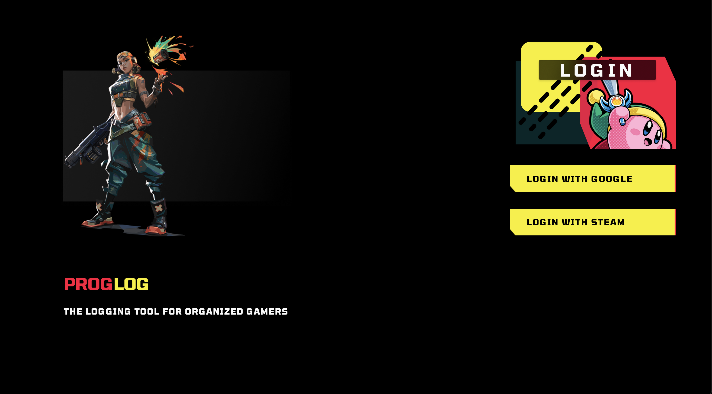
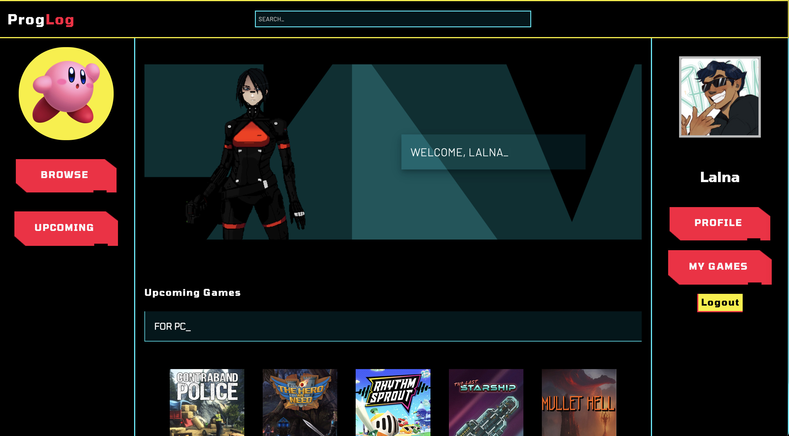
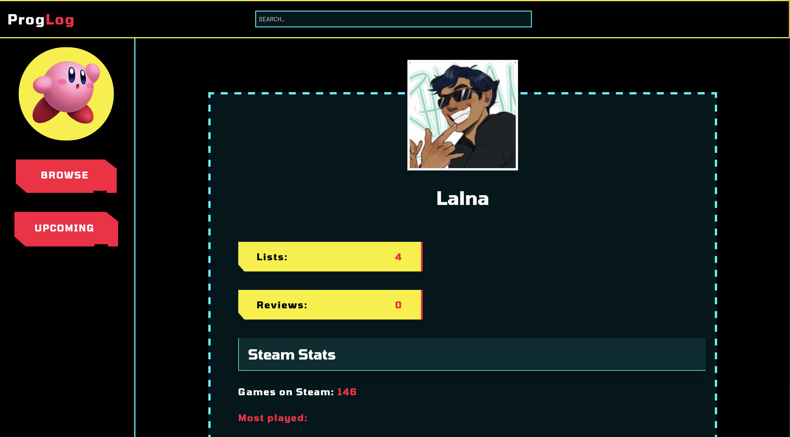
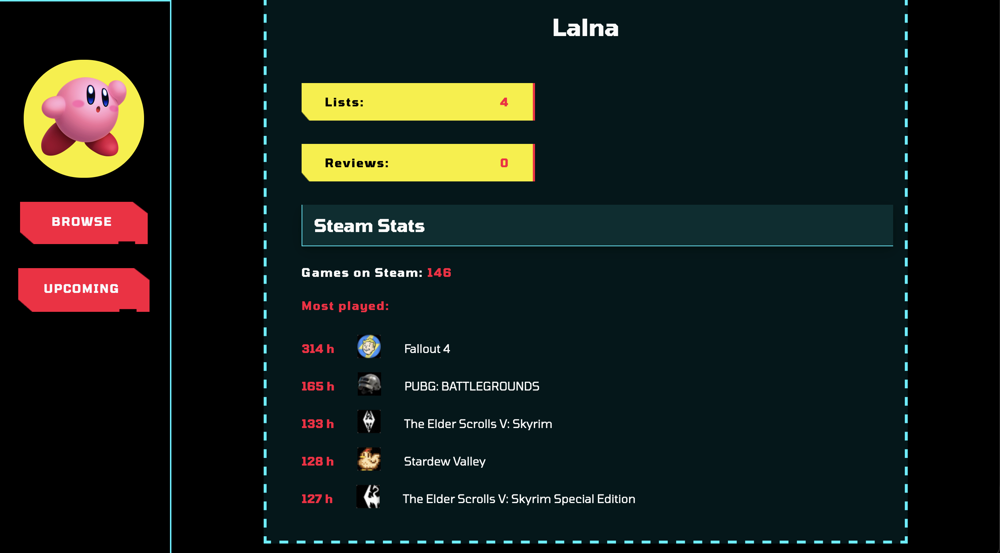
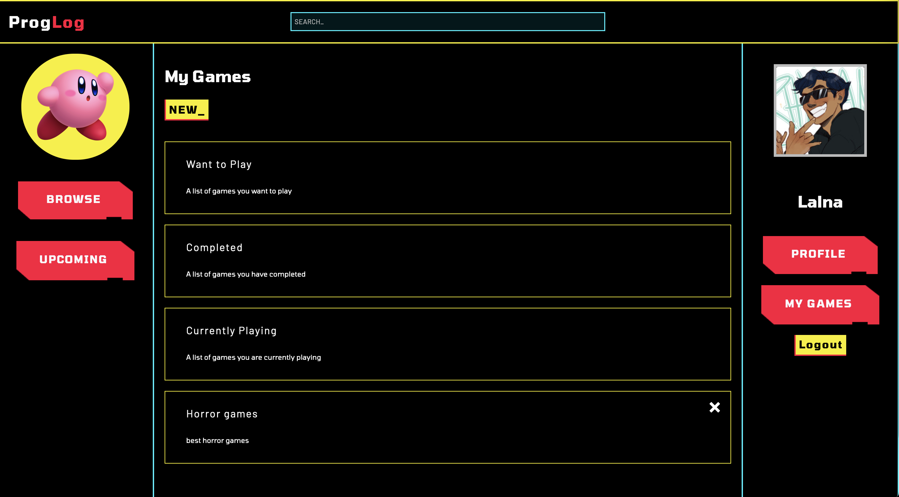
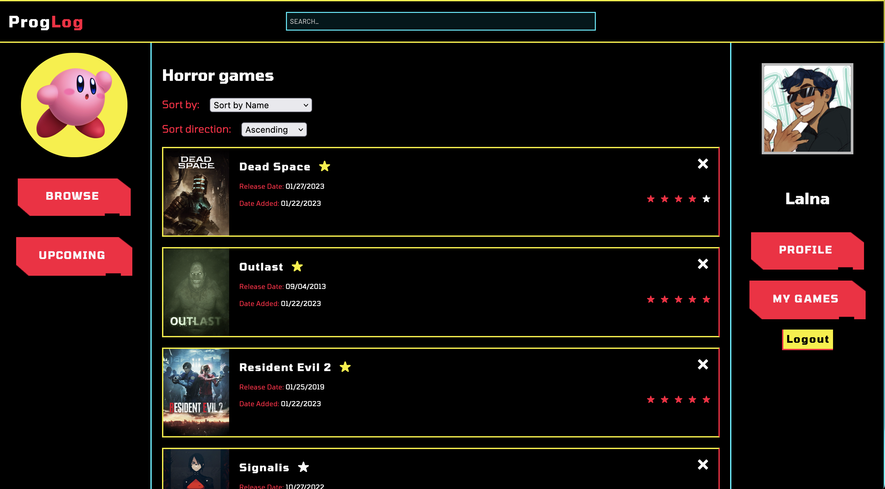
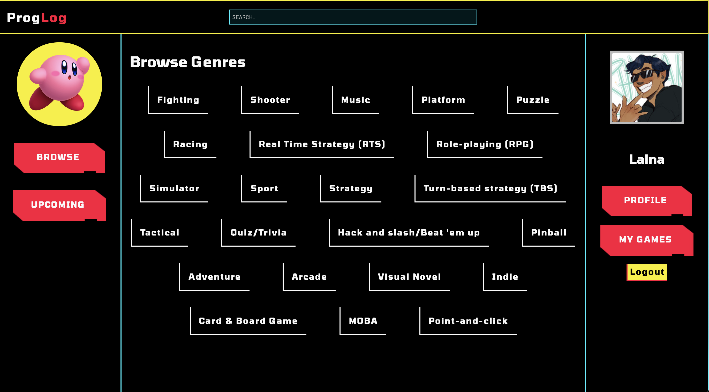

# ProgLog - The logging tool for organized gamers

React web app that fetches data from api <a href="https://github.com/juliajespersdotter/proglog-server">ProgLog server</a>.

ProgLog Client is the web app for organized gamers to store games in lists, review games, rate and favourite them to keep track of what games they have played, are currently playing or just to store their favourite games.

Deployed version of [ProgLog](https://proglog.netlify.app/)

## Table of contents

-   [Overview](#overview)
-   [Built with](#built-with)
-   [Features](#features)
-   [Conclusion](#conclusion)
-   [Printscreens](#printscreens)

## Overview

This site is a logging platform to keep track of video game progress using user lists and reviews to share opinions and gaming experiences with other users. The app is built using React.js, storing data in MySQL database using an api. The games are retrieved using an open source API called IGDB. 

## Built with

-   React.js
-   JavaScript
-   SCSS
-   Node.js
-   Sequelize
-   MySQL
-   Passport.js
-   OAuth
-   Express.js

## Features

-   Viewing, creating and deleting user reviews on video games
-   Viewing, creating and deleting comments on user reviews for a video game
-   Fetching Steam user data to view video games played and owned in external library
-   Authorization with OpenID using OAuth through Steam and Google
-   Viewing, creating, and deleting user lists
-   Video game sorting in user lists and search functionality
-   Viewing user profiles with user lists and reviews

## Conclusion

This project was made as a fun opportunity to learn more fullstack development of web applications and creating a viable application that served a personal use as I like organizing and video games. 

## Printscreens

#### Login page

#### Landing page

#### Profile page

#### Steam profile

#### Library page

#### List page

#### Browse page

